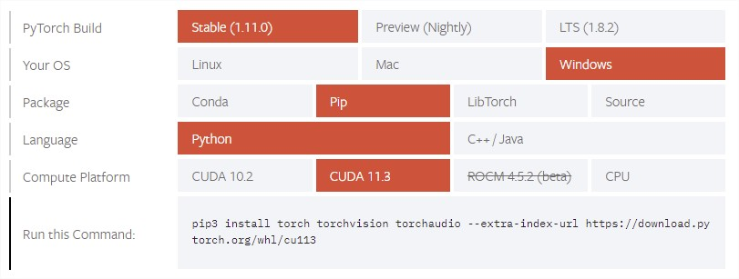

# transformer-slt

This repository fork of the orignal [transformer-slt](https://github.com/kayoyin/transformer-slt), has been created with the aim of supporting the study of intelligent models for sign language translation (SLT), which is part of the Master's Thesis (TFM) carried out for the [Master in Computer Engineering (MII)](https://www.mii.us.es/) of the [University of Seville](https://www.us.es/).

The repository gathers data and code supporting the experiments in the paper [Better Sign Language Translation with STMC-Transformer](https://www.aclweb.org/anthology/2020.coling-main.525/).

## Installation

May differs from the original in [transformer-slt](https://github.com/kayoyin/transformer-slt):

This code is based on [OpenNMT](https://github.com/OpenNMT/OpenNMT-py) v1.0.0 and requires all of its dependencies (`torch==1.6.0`). Additional requirements are [NLTK](https://www.nltk.org/) for NMT evaluation metrics.

The recommended way to install is shown below:

```
# clone the repo
git clone https://github.com/manromero/transformer-slt
cd transformer-slt

# create a new virtual environment
virtualenv --python=python3 venv
# Activate linux:
source venv/bin/activate
# Activate windows:
.\venv\Scripts\activate

# install python dependencies
pip install -r requirements.txt

# install OpenNMT-py
python setup.py install
```

### Known bugs for Windows users

#### Verify that torch has been installed correctly

```
python
> import torch
> torch.cuda.is_available()
# True -> The installation has been successfully completed and it is possible to use the graphics card for training.
# False -> Despite a successful installation, it will not be possible to make use of the graphics card during training, which will cause errors during training.
```

If false:

1. Make sure you have configured CUDA and CUDNN correctly. An example configuration for Windows 11 is available [here](https://youtu.be/OEFKlRSd8Ic?t=123).
2. Perform the Torch installation using the commands available from the [official PyTorch website](https://pytorch.org/get-started/locally/), removing the installed version beforehand.



**Example**

```
pip uninstall torch
pip3 install torch torchvision torchaudio --extra-index-url https://download.pytorch.org/whl/cu113
```

## Sample Usage

### Data processing

```
onmt_preprocess -train_src data/phoenix2014T.train.gloss -train_tgt data/phoenix2014T.train.de -valid_src data/phoenix2014T.dev.gloss -valid_tgt data/phoenix2014T.dev.de -save_data data/dgs -lower
```

### Training

**Linux users**:

```
python  train.py -data data/dgs -save_model model -keep_checkpoint 1 \
          -layers 2 -rnn_size 512 -word_vec_size 512 -transformer_ff 2048 -heads 8  \
          -encoder_type transformer -decoder_type transformer -position_encoding \
          -max_generator_batches 2 -dropout 0.1 \
          -early_stopping 3 -early_stopping_criteria accuracy ppl \
          -batch_size 2048 -accum_count 3 -batch_type tokens -normalization tokens \
          -optim adam -adam_beta2 0.998 -decay_method noam -warmup_steps 3000 -learning_rate 0.5 \
          -max_grad_norm 0 -param_init 0  -param_init_glorot \
          -label_smoothing 0.1 -valid_steps 100 -save_checkpoint_steps 100 \
          -world_size 1 -gpu_ranks 0
```

**Windows users**:

```
python train.py -data data/dgs -save_model model -keep_checkpoint 1 ^
          -layers 2 -rnn_size 512 -word_vec_size 512 -transformer_ff 2048 -heads 8 ^
          -encoder_type transformer -decoder_type transformer -position_encoding ^
          -max_generator_batches 2 -dropout 0.1 ^
          -early_stopping 3 -early_stopping_criteria accuracy ppl ^
          -batch_size 2048 -accum_count 3 -batch_type tokens -normalization tokens ^
          -optim adam -adam_beta2 0.998 -decay_method noam -warmup_steps 3000 -learning_rate 0.5 ^
          -max_grad_norm 0 -param_init 0 -param_init_glorot ^
          -label_smoothing 0.1 -valid_steps 100 -save_checkpoint_steps 100 ^
          -world_size 1 -gpu_ranks 0
```

Runtime: 5 min (Approximate, using NVIDIA GeForce RTX 3070).

### Inference

```
python translate.py -model model [model2 model3 ...] -src data/phoenix2014T.test.gloss -output pred.txt -gpu 0 -replace_unk -beam_size 4
# Example: python translate.py -model model_step_1600.pt -src data/phoenix2014T.test.gloss -output pred.txt -gpu 0 -replace_unk -beam_size 4
```

### Scoring

```
# BLEU-1,2,3,4
python tools/bleu.py 1 pred.txt data/phoenix2014T.test.de
python tools/bleu.py 2 pred.txt data/phoenix2014T.test.de
python tools/bleu.py 3 pred.txt data/phoenix2014T.test.de
python tools/bleu.py 4 pred.txt data/phoenix2014T.test.de

# ROUGE
python tools/rouge.py pred.txt data/phoenix2014T.test.de

# METEOR
python tools/meteor.py pred.txt data/phoenix2014T.test.de
```

# To dos:

- Add configurations & steps to recreate paper results

# Reference

Please cite the original paper below if you found the resources in this repository useful:

```
@inproceedings{yin-read-2020-better,
    title = "Better Sign Language Translation with {STMC}-Transformer",
    author = "Yin, Kayo  and
      Read, Jesse",
    booktitle = "Proceedings of the 28th International Conference on Computational Linguistics",
    month = dec,
    year = "2020",
    address = "Barcelona, Spain (Online)",
    publisher = "International Committee on Computational Linguistics",
    url = "https://www.aclweb.org/anthology/2020.coling-main.525",
    doi = "10.18653/v1/2020.coling-main.525",
    pages = "5975--5989",
    abstract = "Sign Language Translation (SLT) first uses a Sign Language Recognition (SLR) system to extract sign language glosses from videos. Then, a translation system generates spoken language translations from the sign language glosses. This paper focuses on the translation system and introduces the STMC-Transformer which improves on the current state-of-the-art by over 5 and 7 BLEU respectively on gloss-to-text and video-to-text translation of the PHOENIX-Weather 2014T dataset. On the ASLG-PC12 corpus, we report an increase of over 16 BLEU. We also demonstrate the problem in current methods that rely on gloss supervision. The video-to-text translation of our STMC-Transformer outperforms translation of GT glosses. This contradicts previous claims that GT gloss translation acts as an upper bound for SLT performance and reveals that glosses are an inefficient representation of sign language. For future SLT research, we therefore suggest an end-to-end training of the recognition and translation models, or using a different sign language annotation scheme.",
}
```
